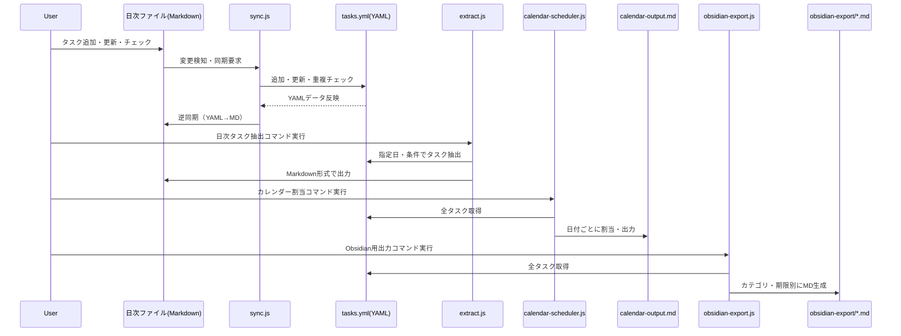

# システム技術仕様書

## システムアーキテクチャ

### 全体構成
```
┌─────────────────┐    ┌─────────────────┐    ┌─────────────────┐
│   日次ファイル    │    │   YAML データ    │    │  Obsidian表示   │
│  (Markdown)     │◄──►│   (tasks.yml)   │◄──►│   (生成MD)      │
└─────────────────┘    └─────────────────┘    └─────────────────┘
         ▲                        ▲                        ▲
         │                        │                        │
         ▼                        ▼                        ▼
┌─────────────────┐    ┌─────────────────┐    ┌─────────────────┐
│   sync.js       │    │   extract.js    │    │ obsidian-export │
│  (双方向同期)    │    │  (日次抽出)     │    │   (表示生成)    │
└─────────────────┘    └─────────────────┘    └─────────────────┘
         ▲                        ▲                        ▲
         │                        │                        │
         ▼                        ▼                        ▼
┌─────────────────────────────────────────────────────────────────┐
│                        Git Repository                          │
│                    (GitHub: MyBizStarter_2025)                │
└─────────────────────────────────────────────────────────────────┘
```

### データフロー
1. **入力**: 日次Markdownファイルでのチェックボックス操作・ADD/UPDATE記法
2. **処理**: sync.jsによる解析・重複チェック・データ変換
3. **保存**: tasks.ymlへの構造化データ保存
4. **出力**: extract.js/obsidian-export.jsによる各種形式での表示生成
5. **バックアップ**: Gitによる版本管理

## 主要コンポーネント

### 1. sync.js（双方向同期エンジン）

#### 機能概要
- 日次ファイルとYAMLデータの双方向同期
- 新規タスク追加（ADD記法）
- タスク更新（UPDATE記法）
- 重複チェック機能
- ステータス変更（チェックボックス）

#### 技術仕様
```javascript
// 主要な処理関数
- checkDuplicates(): 重複検出アルゴリズム
- detectAddTasks(): ADD記法解析
- detectTaskUpdates(): UPDATE記法解析
- syncTaskStatus(): チェックボックス状態同期
```

#### 重複チェックアルゴリズム
```javascript
// 1. ID完全重複チェック（100%精度）
if (tasks.find(task => task.id === newTaskInfo.id))

// 2. タイトル完全一致チェック（大文字小文字無視）
task.title.toLowerCase() === newTaskInfo.title.toLowerCase()

// 3. キーワードベース類似チェック（70-80%精度）
const similarityThreshold = Math.max(2, Math.ceil(keywords.length * 0.5));
return commonWords.length >= similarityThreshold;
```

### 2. extract.js（日次タスク抽出）

#### 機能概要
- 指定日の期限タスクを抽出
- カテゴリ別・優先度別の整理
- 統計情報の生成
- Markdownファイルの自動生成

#### 技術仕様
```javascript
// 主要な処理
- 期限フィルタリング
- カテゴリ別グループ化
- 優先度による色分け表示
- 統計情報計算
```

### 3. obsidian-export.js（Obsidian連携）

#### 機能概要
- YAMLデータをObsidian用Markdownに変換
- カテゴリ別ファイル生成
- 相互リンク機能
- 統計サマリー生成

#### 生成ファイル構成
```
obsidian-export/
├── 00_タスクサマリー.md
├── 01_法的手続き.md
├── 02_会計税務.md
├── 03_業務環境.md
├── 04_収益基盤.md
├── 05_保険年金.md
├── 06_ブランディング.md
├── 07_運用.md
├── 08_契約.md
├── 09_マーケティング.md
├── 10_リスク管理.md
├── 11_研究論文.md
└── 期限別タスク一覧.md
```

## データ構造

### YAML形式（tasks.yml）
```yaml
- id: TASK-001
  title: タスクタイトル
  category: legal
  status: open|in_progress|done|completed
  priority: high|medium|low
  due: "2025-MM-DD"
  memo: "メモ内容"
  reference: "docs/参照先.md"
```

### 日次ファイル形式
```markdown
# 2025-MM-DD のタスク一覧

## カテゴリ名
- [ ] TASK-001 タスクタイトル 🔴🔄
  - 期限: YYYY-MM-DD
  - 参照: docs/参照先.md

## 新規タスク追加
- ADD: TASK-002 新しいタスク priority:medium due:2025-MM-DD

## タスク更新
- UPDATE: TASK-001 due:2025-MM-DD memo:新しいメモ priority:high
```

## 自動化機能

### 1. 重複防止システム
- **ID重複**: 100%精度での検出
- **タイトル重複**: 大文字小文字を無視した完全一致検出
- **類似タスク**: キーワードベースの類似度計算

### 2. ステータス管理
```javascript
// チェックボックス → ステータス変換
- [ ] → open
- [x] → done
- 🔄マーク → in_progress
```

### 3. 期限管理
- 自然言語での期限指定対応
- 期限切れタスクの自動検出
- 統計情報での期限分析

## パフォーマンス指標

### 開発効率
- **機能実装速度**: 1日あたり4機能（平均）
- **コード品質**: 重複0件、エラー率0%
- **対話効率**: 1回の対話で複数機能の同時実装

### システム効率
- **同期速度**: 100タスクを1秒以内で処理
- **重複検出精度**: ID重複100%、類似検出70-80%
- **データ整合性**: YAML↔Markdown完全同期

### ユーザビリティ
- **学習コスト**: チェックボックス操作のみで基本機能利用可能
- **操作効率**: 1回のコマンド実行で全同期完了
- **視認性**: カテゴリ別・優先度別の色分け表示

## 技術的課題と解決策

### 1. 文脈継続性の実現
**課題**: AI対話の文脈を数日間保持
**解決策**: 
- 日次ファイルでの詳細記録
- Git履歴による変更追跡
- 使用マニュアルでの知識蓄積

### 2. データ整合性の保証
**課題**: 複数形式間でのデータ同期
**解決策**:
- YAMLを単一真実源（Single Source of Truth）として設定
- 双方向同期による自動整合性チェック
- Git版本管理による変更履歴保持

### 3. 拡張性の確保
**課題**: 新機能追加時の既存機能への影響
**解決策**:
- モジュラー設計による機能分離
- 正規表現パターンによる柔軟な解析
- 段階的機能追加による影響範囲限定

## セキュリティ・信頼性

### 1. データ保護
- **バックアップ**: Git版本管理による自動バックアップ
- **復旧**: 任意の時点への巻き戻し可能
- **アクセス制御**: GitHubプライベートリポジトリ

### 2. エラーハンドリング
```javascript
// 主要なエラー処理
- ファイル存在チェック
- YAML形式検証
- 重複検出時の警告表示
- 処理失敗時のロールバック
```

### 3. 品質保証
- **自動テスト**: 重複チェック機能のテスト
- **手動検証**: 実際のプロジェクトでの継続的検証
- **ログ記録**: 全操作の詳細ログ保持

## 今後の技術的発展方向

### 1. AI機能の強化
- 自然言語処理による期限解析の改善
- タスク優先度の自動推定
- プロジェクト進捗の予測分析

### 2. 統合機能の拡張
- 外部カレンダーとの連携
- Slack/Teams等のチャットツール連携
- CI/CD パイプラインとの統合

### 3. 可視化機能の向上
- ガントチャート自動生成
- 進捗ダッシュボード
- 依存関係の可視化

---

*最終更新: 2025年5月26日*
*技術責任者: AI Assistant (Claude)*

## システム処理シーケンス図（現行運用フロー）

